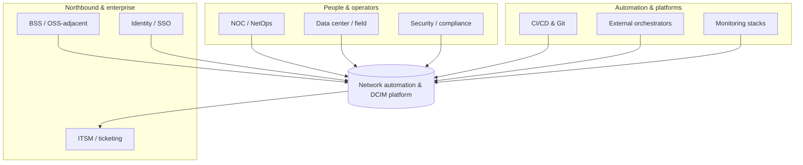
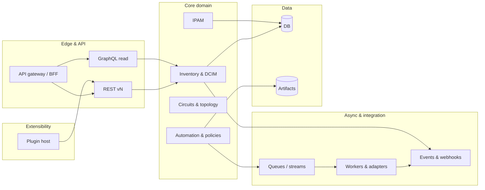
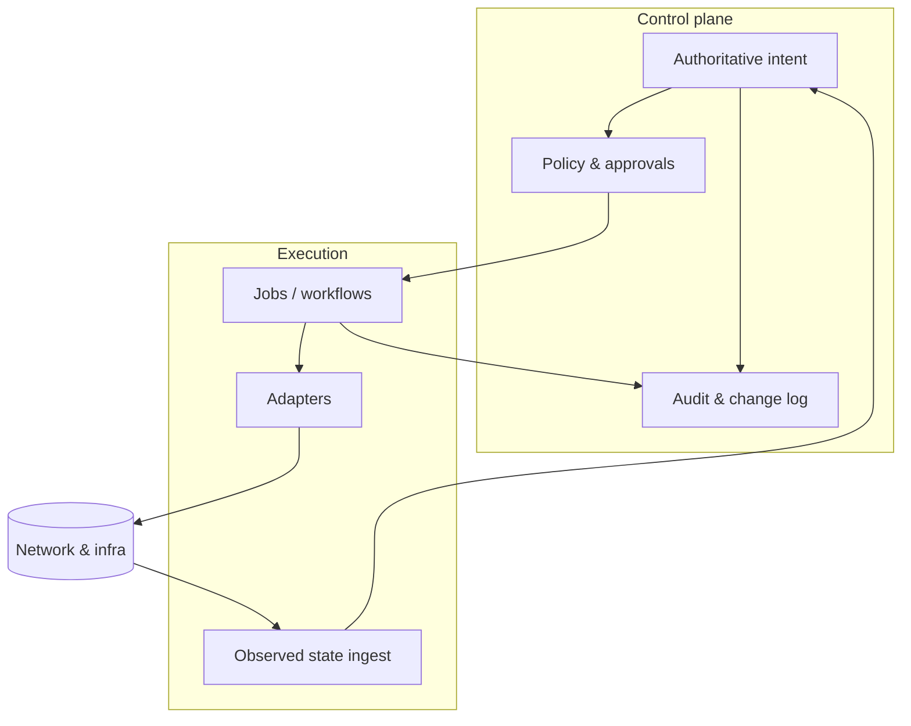

# Network automation & DCIM platform (planning)

**Repository:** [github.com/amne51ac/untitled-dcim-and-automation-system](https://github.com/amne51ac/untitled-dcim-and-automation-system)

This repository captures **clean-room research** and a **product roadmap** for a new **network source of truth**, **DCIM**, and **network automation** platform aimed at **provider and distributor scale**: ISPs, backbone operators, hyperscale-adjacent network teams, and large infrastructure organizations that need **throughput**, **resilience**, and **operational maturity**—not lab-sized tooling.

The work is **inspired by** design lessons synthesized from multiple reference systems (documented under [`cleanroom/`](cleanroom/README.md) using neutral **Source A–H** and **Additional Source 1** designations). This codebase does **not** copy any third-party source; it is a **planning and specification** home for a greenfield implementation.

**Diagrams:** High-resolution visuals (context, containers, deployment, sequences, plugins) live in [`docs/architecture.md`](docs/architecture.md). Key figures are inlined below for quick reading on GitHub.

---

## Vision (one paragraph)

Build an **API-first**, **multi-region**, **multi-cloud**-deployable platform that is the **authoritative intent** for network and facility inventory, **orchestrates** change through safe automation, **integrates** with BSS/OSS-adjacent and cloud ecosystems where needed, and scales to **high cardinality** objects, **high write/read** API rates, and **always-on** operations—with **plugins**, **integrations**, and **policy** as first-class citizens.

---

## Architecture at a glance

### System context

Operators, enterprise systems, and automation peers interact with the platform; it remains the **system of record** for intent while delegating execution to adapters.



### Logical containers (how it decomposes)

The **edge** stays stateless; **core services** own domain consistency; **workers** handle rate-limited and long-running work; **plugins** extend without forking core.



### Control plane vs data plane

**Intent and policy** live in the control plane; **jobs and adapters** execute in the data plane. Reconciliation closes the loop so drift is visible and actionable.



More diagrams (multi-region deployment, end-to-end change sequence, plugin boundary) are in [`docs/architecture.md`](docs/architecture.md).

---

## How we will use the cleanroom output

The [`cleanroom/`](cleanroom/README.md) tree holds **capability and architecture notes** derived from reference platforms (open-source and one commercial marketing survey). We use it in **four** concrete ways:

1. **Requirements & domain model** — Consolidate overlapping concepts (DCIM, IPAM, circuits, virtualization, cloud-adjacent objects, jobs, events) into a **single coherent model** tuned for **provider** semantics (tenancy, hierarchy, bulk operations, long-lived identifiers).
2. **Platform vs. product boundaries** — Decide what is **core platform** (auth, tenancy, audit, APIs, jobs, events, plugin host) versus **optional apps** (e.g. compliance, discovery adapters, reporting packs), using Source A’s automation-platform posture as a baseline and AS1’s “active inventory + orchestration + assurance” framing where it informs **operator-scale** packaging.
3. **Non-functional targets** — Translate comparison notes into **SLOs**: API latency under load, ingestion rates, worker throughput, RPO/RTO, multi-AZ behavior, and **horizontal** scaling stories for stateless tiers.
4. **Differentiation** — Explicitly borrow **ideas** (not code), e.g. lightweight IPAM ergonomics (Source C), asset lifecycle depth (Source D), DDI-adjacent patterns (Source E), observability adjacency (Source F), facility reporting (Sources G–H), and commercial **suite integration** patterns (Additional Source 1)—only where they fit **provider-scale** requirements.

### Traceability sketch (cleanroom → delivery)

| Cleanroom theme | How it lands in the product |
|-----------------|-----------------------------|
| Source A — extensibility, jobs, APIs, events | Core **plugin host**, **REST/GraphQL/event** contracts, **automation** spine |
| Sources B–D — alternate DCIM/IPAM shapes | **Domain model** refinements and **import/export** ergonomics |
| Source E — service/request workflows | **Approval** and **request** objects as first-class (not an afterthought) |
| Source F — monitoring adjacency | **Telemetry** ingest, correlation IDs, **observed vs intended** state |
| Sources G–H — facility / SNMP angles | **Reporting** apps, **discovery** adapters as optional packs |
| AS1 — inventory + orchestration + assurance | **Closed-loop** narratives in roadmap Phase 3+ (without copying proprietary designs) |

Each subsection in [`cleanroom/source-a/`](cleanroom/source-a/INDEX.md) and sibling sources maps to **epics** in the implementation tracker (to be added as the SDLC matures).

---

## Roadmap phases (detailed)

### Phase 0 — Foundation (this repo)

| Track | Deliverables | Exit criteria |
|-------|----------------|---------------|
| **Traceability** | Maintain [`cleanroom/`](cleanroom/README.md) as the requirements backbone; link epics to source sections | Every major epic cites a cleanroom anchor |
| **Decisions** | **ADRs** for language, primary datastore, messaging, API styles, tenancy model | ADRs merged; no “mystery stack” |
| **Process** | **Contributing**, **security baseline**, **branching**, **review** bar | Contributors can onboard from repo docs alone |

### Phase 1 — Core platform skeleton

- **Identity & tenancy** — Organizations, projects, RBAC/ABAC, audit log, API tokens, SSO hooks; **tenant-scoped** namespaces for all resources.
- **Data model v1** — Locations, racks, devices, interfaces, cables, IPAM core, minimal circuits; **UUID** keys; **soft-delete**; **immutable change** stream for audit and sync.
- **Public APIs** — Versioned **REST**; **GraphQL** read path for flexible operations consoles; **event** contract (webhooks + broker integration).
- **Plugin host** — Installable apps with **versioned** surfaces and **isolated** failure domains; **no core fork** for typical extensions.
- **Developer experience** — Local dev stack, seed data, **OpenAPI** and schema artifacts published per release.

### Phase 2 — Automation & scale

- **Job engine** — Async execution, schedules, approvals, **idempotency**, **per-tenant** fairness and quotas.
- **Git-backed artifacts** — Config templates, policy bundles, **signed** provenance for automation inputs.
- **Horizontal scale** — Stateless API tier; **read replicas**; **cache**; **partition-friendly** keys for future sharding.
- **HA** — Multi-AZ database; **zero-downtime** migrations; **graceful degradation** when workers lag (read-heavy paths stay up).

### Phase 3 — Provider-grade operations

- **Bulk** — Import/export at **provider** volumes; **CSV** and structured interchange; **backpressure** and rate limits on heavy jobs.
- **Observability** — Metrics, traces, structured logs; **SLO** dashboards per tenant tier; **error budget** policy.
- **Multi-cloud** — Reference **Kubernetes** deployments; **object storage** for artifacts; **cloud secrets** integration; **air-gapped** profile where required.
- **Integrations** — Ticketing, discovery/IPAM adapters, **northbound** APIs where customers need BSS-style handoff—without mandating a monolith.

### Phase 4 — Maturity & ecosystem

- **Ecosystem** — Certification path for third-party apps; optional **marketplace** mechanics.
- **Resilience** — **DR** runbooks; tested **restore** drills; game days.
- **Compliance** — Policy-as-code and data residency as **apps**, not forks; export and **regional** deployment hooks.

---

## Non-functional requirements (targets)

| Area | Direction |
|------|-----------|
| **Capacity & volume** | Design for **millions** of inventory objects and **sustained** API traffic; batch and streaming **ingestion** paths. |
| **Availability** | **HA** control plane; **multi-AZ** data tier; clear **RPO/RTO** per deployment profile. |
| **Scalability** | **Scale-out** stateless services; **queue**-based workers; **partition**-friendly keys where sharding is needed. |
| **Security** | **Zero-trust**-friendly authn/z, **secrets** externalization, **encryption** in transit and at rest, **audit** on all mutating paths. |
| **Deployability** | **Helm**/**Kustomize** (or equivalent), **infra-as-code** examples, **air-gapped** options for regulated providers. |
| **Operability** | **SRE**-friendly metrics; **runbooks**; **feature flags**; safe **rollouts**. |
| **Extensibility** | **Plugins/apps** with stable contracts; **webhooks**; **event** fan-out; **custom fields** and **policy hooks** without core forks. |

### Illustrative SLOs (to be validated per ADR)

These are **planning placeholders** until load testing exists; they express **provider-scale** intent.

| Surface | Target (starting point) |
|---------|-------------------------|
| Read-heavy API (p99) | Low hundreds of ms at design load |
| Mutating API (p99) | Bounded latency; async where work is heavy |
| Event delivery | At-least-once with idempotent consumers |
| Planned maintenance | Zero-downtime for API tier where possible |

---

## SDLC & quality bar

```mermaid
flowchart LR
  subgraph dev["Develop"]
    TR[Trunk / short branches]
    ADR[ADRs for behavior changes]
  end

  subgraph ci["CI"]
    L[Lint & types]
    T[Tests]
    API[Contract tests]
    M[Migrations]
  end

  subgraph cd["CD"]
    ST[Staging]
    CAN[Canary]
    RB[Rollback criteria]
  end

  subgraph ops["Operate"]
    SBOM[SBOM & deps]
    RUN[Runbooks]
    OBS[SLOs & alerts]
  end

  TR --> L
  ADR --> TR
  L --> T
  T --> API
  API --> M
  M --> ST
  ST --> CAN
  CAN --> RB
  RB --> SBOM
  SBOM --> RUN
  RUN --> OBS
```



- **Trunk-based** or **short-lived** branches with **required** reviews for core.
- **CI**: lint, typecheck, unit/integration tests, **API contract** checks, **migration** tests.
- **CD**: staged environments; **canary** for risky changes; **automated** rollback criteria.
- **Documentation**: user docs, operator runbooks, **OpenAPI**/GraphQL schema as artifacts.
- **Supply chain**: pinned dependencies, **SBOM** generation, **CVE** response process.

---

## Repository layout (current)

```
cleanroom/          # Clean-room capability & design research (Source A–H, AS1)
docs/               # Architecture visuals, publishing notes
  architecture.md   # Extended Mermaid diagrams
  PUBLISHING.md     # Git / GitHub CLI steps
platform/           # Phase 1 implementation (API, schema, minimal console)
  api server: Node + Fastify + Prisma + PostgreSQL; GraphQL read at /graphql
  web/console.html  # Optional static helper to call the API from a browser
README.md           # This plan
LICENSE             # Apache-2.0
```

### Run the platform API (local)

From [`platform/`](platform/): copy `.env.example` to `.env`, start Postgres (`docker compose up -d`), then `npm install`, `npx prisma migrate dev`, `npm run db:seed`, `npm run dev`. Open `http://localhost:8080/docs` for OpenAPI and `/graphql` for GraphiQL. Use the seed-printed Bearer token on `/v1/me`.

Infrastructure-as-code and ADRs can be added alongside this skeleton as the SDLC matures.

---

## Naming & attribution

Reference systems are discussed in [`cleanroom/`](cleanroom/README.md) using **Source A**, **Source B**, etc., to avoid implying affiliation or endorsement. This project is **independent** greenfield work.

---

## License

See [`LICENSE`](LICENSE). Documentation and specifications contributed here are intended to be **open**; implementation code will follow the same license unless stated otherwise in subfolders.

---

## Clone & contribute

```bash
git clone https://github.com/amne51ac/untitled-dcim-and-automation-system.git
```

Additional **init / remote** notes (if you fork or mirror) remain in [`docs/PUBLISHING.md`](docs/PUBLISHING.md).
