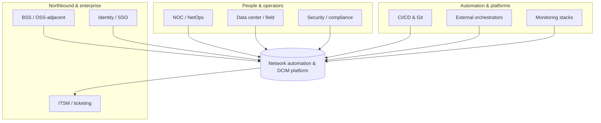
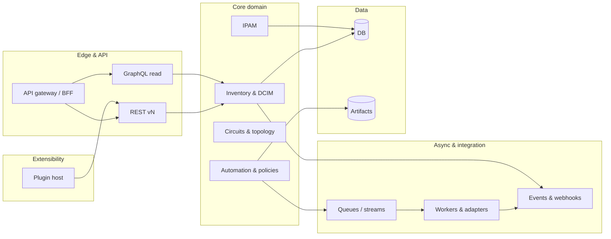
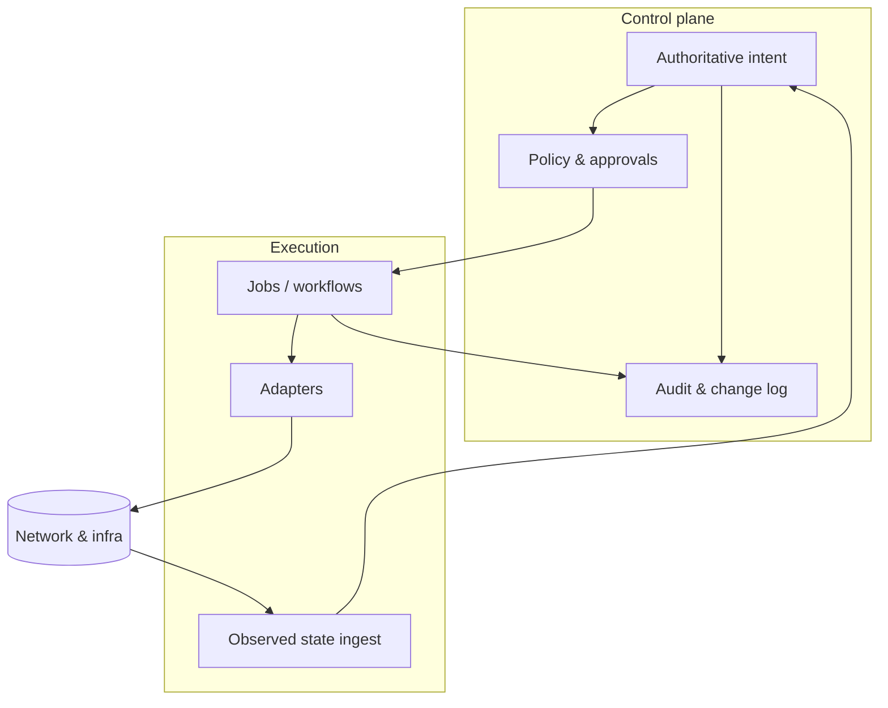

# IntentCenter — network automation & DCIM platform

**Project:** IntentCenter · **Live demo:** [https://demo.intentcenter.io](https://demo.intentcenter.io) · **Repository:** <a href="https://github.com/amne51ac/intentcenter"></a> [github.com/amne51ac/intentcenter](https://github.com/amne51ac/intentcenter) · <a href="https://github.com/amne51ac/intentcenter/blob/main/README.md"></a> [README on GitHub](https://github.com/amne51ac/intentcenter/blob/main/README.md)

**Documentation website (GitHub Pages):** after enabling Pages from the `/docs` folder on `main`, the static site is served at **[https://amne51ac.github.io/intentcenter/](https://amne51ac.github.io/intentcenter/)** — landing page, console-aligned styling, screenshots, full doc hub, architecture (Mermaid), roadmap, platform API summary, LLM design, and clean-room index. See [`docs/README.md`](docs/README.md).

This repository captures **clean-room research** and a **product roadmap** for IntentCenter: a new **network source of truth**, **DCIM**, and **network automation** platform aimed at **provider and distributor scale**: ISPs, backbone operators, hyperscale-adjacent network teams, and large infrastructure organizations that need **throughput**, **resilience**, and **operational maturity**—not lab-sized tooling.

The work is **inspired by** design lessons synthesized from multiple reference systems (documented under [`cleanroom/`](cleanroom/README.md) using neutral **Source A–H** and **Additional Source 1** designations). This codebase does **not** copy any third-party source; it is a **planning and specification** home for a greenfield implementation.

**Diagrams:** High-resolution visuals (context, containers, deployment, sequences, plugins) live in [`docs/architecture.md`](docs/architecture.md). Key figures are inlined below for quick reading on GitHub.

---

## Vision (one paragraph)

Build an **API-first**, **multi-region**, **multi-cloud**-deployable platform that is the **authoritative intent** for network and facility inventory, **orchestrates** change through safe automation, **integrates** with BSS/OSS-adjacent and cloud ecosystems where needed, and scales to **high cardinality** objects, **high write/read** API rates, and **always-on** operations—with **plugins**, **integrations**, and **policy** as first-class citizens.

---

## Architecture at a glance

### System context

Operators, enterprise systems, and automation peers interact with the platform; it remains the **system of record** for intent while delegating execution to adapters.



### Logical containers (how it decomposes)

The **edge** stays stateless; **core services** own domain consistency; **workers** handle rate-limited and long-running work; **plugins** extend without forking core.



### Control plane vs data plane

**Intent and policy** live in the control plane; **jobs and adapters** execute in the data plane. Reconciliation closes the loop so drift is visible and actionable.



More diagrams (multi-region deployment, end-to-end change sequence, plugin boundary) are in [`docs/architecture.md`](docs/architecture.md).

**Implementation status:** The diagrams above describe the **target** platform (queues, workers, multi-region, and similar). The code under [`platform/`](platform/) today is a **Phase 1 skeleton**: one **FastAPI** process, **PostgreSQL**, Prisma for **migrations** only, optional **React** static assets served by the API. There is **no** separate worker tier or Celery-style queue in-tree yet (see roadmap Phase 2).

---

## How we will use the cleanroom output

The [`cleanroom/`](cleanroom/README.md) tree holds **capability and architecture notes** derived from reference platforms (open-source and one commercial marketing survey). We use it in **four** concrete ways:

1. **Requirements & domain model** — Consolidate overlapping concepts (DCIM, IPAM, circuits, virtualization, cloud-adjacent objects, jobs, events) into a **single coherent model** tuned for **provider** semantics (tenancy, hierarchy, bulk operations, long-lived identifiers).
2. **Platform vs. product boundaries** — Decide what is **core platform** (auth, tenancy, audit, APIs, jobs, events, plugin host) versus **optional apps** (e.g. compliance, discovery adapters, reporting packs), using Source A’s automation-platform posture as a baseline and AS1’s “active inventory + orchestration + assurance” framing where it informs **operator-scale** packaging.
3. **Non-functional targets** — Translate comparison notes into **SLOs**: API latency under load, ingestion rates, worker throughput, RPO/RTO, multi-AZ behavior, and **horizontal** scaling stories for stateless tiers.
4. **Differentiation** — Explicitly borrow **ideas** (not code), e.g. lightweight IPAM ergonomics (Source C), asset lifecycle depth (Source D), DDI-adjacent patterns (Source E), observability adjacency (Source F), facility reporting (Sources G–H), and commercial **suite integration** patterns (Additional Source 1)—only where they fit **provider-scale** requirements.

### Traceability sketch (cleanroom → delivery)

| Cleanroom theme | How it lands in the product |
|-----------------|-----------------------------|
| Source A — extensibility, jobs, APIs, events | Core **plugin host**, **REST/GraphQL/event** contracts, **automation** spine |
| Sources B–D — alternate DCIM/IPAM shapes | **Domain model** refinements and **import/export** ergonomics |
| Source E — service/request workflows | **Approval** and **request** objects as first-class (not an afterthought) |
| Source F — monitoring adjacency | **Telemetry** ingest, correlation IDs, **observed vs intended** state |
| Sources G–H — facility / SNMP angles | **Reporting** apps, **discovery** adapters as optional packs |
| AS1 — inventory + orchestration + assurance | **Closed-loop** narratives in roadmap Phase 3+ (without copying proprietary designs) |

Each subsection in [`cleanroom/source-a/`](cleanroom/source-a/INDEX.md) and sibling sources maps to **epics** in the implementation tracker (to be added as the SDLC matures).

---

## Roadmap phases (detailed)

### Phase 0 — Foundation (this repo)

| Track | Deliverables | Exit criteria |
|-------|----------------|---------------|
| **Traceability** | Maintain [`cleanroom/`](cleanroom/README.md) as the requirements backbone; link epics to source sections | Every major epic cites a cleanroom anchor |
| **Decisions** | **ADRs** for language, primary datastore, messaging, API styles, tenancy model | ADRs merged; no “mystery stack” |
| **Process** | **Contributing**, **security baseline**, **branching**, **review** bar | Contributors can onboard from repo docs alone |

### Phase 1 — Core platform skeleton

- **Identity & tenancy** — Organizations, projects, RBAC/ABAC, audit log, API tokens, SSO hooks; **tenant-scoped** namespaces for all resources.
- **Data model v1** — Locations, racks, devices, interfaces, cables, IPAM core, minimal circuits; **UUID** keys; **soft-delete**; **immutable change** stream for audit and sync.
- **Public APIs** — Versioned **REST**; **GraphQL** read path for flexible operations consoles; **event** contract (webhooks + broker integration).
- **Plugin host** — Installable apps with **versioned** surfaces and **isolated** failure domains; **no core fork** for typical extensions.
- **Developer experience** — Local dev stack, seed data, **OpenAPI** and schema artifacts published per release.

### Phase 2 — Automation & scale

- **Job engine** — Async execution, schedules, approvals, **idempotency**, **per-tenant** fairness and quotas.
- **Git-backed artifacts** — Config templates, policy bundles, **signed** provenance for automation inputs.
- **Horizontal scale** — Stateless API tier; **read replicas**; **cache**; **partition-friendly** keys for future sharding.
- **HA** — Multi-AZ database; **zero-downtime** migrations; **graceful degradation** when workers lag (read-heavy paths stay up).

### Phase 3 — Provider-grade operations

- **Bulk** — Import/export at **provider** volumes; **CSV** and structured interchange; **backpressure** and rate limits on heavy jobs.
- **Observability** — Metrics, traces, structured logs; **SLO** dashboards per tenant tier; **error budget** policy.
- **Multi-cloud** — Reference **Kubernetes** deployments; **object storage** for artifacts; **cloud secrets** integration; **air-gapped** profile where required.
- **Integrations** — Ticketing, discovery/IPAM adapters, **northbound** APIs where customers need BSS-style handoff—without mandating a monolith.

### Phase 4 — Maturity & ecosystem

- **Ecosystem** — Certification path for third-party apps; optional **marketplace** mechanics.
- **Resilience** — **DR** runbooks; tested **restore** drills; game days.
- **Compliance** — Policy-as-code and data residency as **apps**, not forks; export and **regional** deployment hooks.

---

## Non-functional requirements (targets)

| Area | Direction |
|------|-----------|
| **Capacity & volume** | Design for **millions** of inventory objects and **sustained** API traffic; batch and streaming **ingestion** paths. |
| **Availability** | **HA** control plane; **multi-AZ** data tier; clear **RPO/RTO** per deployment profile. |
| **Scalability** | **Scale-out** stateless services; **queue**-based workers; **partition**-friendly keys where sharding is needed. |
| **Security** | **Zero-trust**-friendly authn/z, **secrets** externalization, **encryption** in transit and at rest, **audit** on all mutating paths. |
| **Deployability** | **Helm**/**Kustomize** (or equivalent), **infra-as-code** examples, **air-gapped** options for regulated providers. |
| **Operability** | **SRE**-friendly metrics; **runbooks**; **feature flags**; safe **rollouts**. |
| **Extensibility** | **Plugins/apps** with stable contracts; **webhooks**; **event** fan-out; **custom fields** and **policy hooks** without core forks. |

### Illustrative SLOs (to be validated per ADR)

These are **planning placeholders** until load testing exists; they express **provider-scale** intent.

| Surface | Target (starting point) |
|---------|-------------------------|
| Read-heavy API (p99) | Low hundreds of ms at design load |
| Mutating API (p99) | Bounded latency; async where work is heavy |
| Event delivery | At-least-once with idempotent consumers |
| Planned maintenance | Zero-downtime for API tier where possible |

---

## SDLC & quality bar

```mermaid
flowchart LR
  subgraph dev["Develop"]
    TR[Trunk / short branches]
    ADR[ADRs for behavior changes]
  end

  subgraph ci["CI"]
    L[Lint & types]
    T[Tests]
    API[Contract tests]
    M[Migrations]
  end

  subgraph cd["CD"]
    ST[Staging]
    CAN[Canary]
    RB[Rollback criteria]
  end

  subgraph ops["Operate"]
    SBOM[SBOM & deps]
    RUN[Runbooks]
    OBS[SLOs & alerts]
  end

  TR --> L
  ADR --> TR
  L --> T
  T --> API
  API --> M
  M --> ST
  ST --> CAN
  CAN --> RB
  RB --> SBOM
  SBOM --> RUN
  RUN --> OBS
```



- **Trunk-based** or **short-lived** branches with **required** reviews for core.
- **CI**: lint, typecheck, unit/integration tests, **API contract** checks, **migration** tests.
- **CD**: staged environments; **canary** for risky changes; **automated** rollback criteria.
- **Documentation**: user docs, operator runbooks, **OpenAPI**/GraphQL schema as artifacts.
- **Supply chain**: pinned dependencies, **SBOM** generation, **CVE** response process.

---

## Repository layout (current)

```
.github/workflows/  # platform-ci.yml — lint, typecheck, web build, pytest (see Tests & CI)
cleanroom/            # Clean-room capability & design research (Source A–H, AS1)
docs/                 # Architecture visuals, GitHub Pages static site (console-aligned CSS + screenshots)
  index.html          # Landing + product screenshots; links to live demo
  documentation.html  # Doc hub + links to Markdown sources on GitHub
  assets/             # site.css, logos, favicon, assets/screenshots/*.png
  architecture.md     # Extended Mermaid diagrams (authoritative alongside architecture.html)
  README.md           # Docs folder index (Pages + custom domain notes)
  .nojekyll           # Serve static HTML without Jekyll
platform/             # Phase 1 implementation (schema, Python API, React console)
  README.md           # Short platform + web UI notes (see root README for full runbook)
  prisma/             # Schema & migrations (Prisma); PostgreSQL is the datastore
  backend/            # Python API — FastAPI + SQLAlchemy; OpenAPI; GraphQL at /graphql
  web/                # React + Vite UI (build output served by the API under /app/)
  package.json        # Prisma CLI, ESLint for web/, web build; seed is Python (`nims-seed`)
  Makefile            # uv-based API: sync, api, seed, test, lint, format
  backend/uv.lock     # Pinned Python dependencies (use with `uv sync` in backend/)
README.md             # This plan
LICENSE               # GNU AGPL-3.0
```

### Run the platform API (local)

From [`platform/`](platform/):

1. Copy [`.env.example`](platform/.env.example) to `.env` and set `DATABASE_URL` and `JWT_SECRET` (see comments in that file).
2. Start Postgres (e.g. `docker compose up -d` in `platform/`).
3. **Install [uv](https://docs.astral.sh/uv/)** (recommended) or use `pip` + a venv under `backend/`.
4. **Node tooling (Prisma + web only):** `npm install` in `platform/`, then **`npm install --prefix web`** (or `npm ci --prefix web`) so the SPA can build and run—same split as CI (`npm ci && npm ci --prefix web`). Run **`npx prisma migrate dev`** (and **`npx prisma generate`** if you use Prisma Client from Node). Seed with **`make seed`** or **`npm run db:seed`** (both run **`nims-seed`** via uv). Optionally **`npm run web:build`** so the API can serve the React app from `web/dist` at `/app/`. For Vite dev server only: **`npm run web:dev`** from `platform/`.
5. **Python API:** from `platform/`, **`make sync`** (or `cd backend && uv sync --all-extras`, using **`backend/uv.lock`**) installs dependencies; start with **`make api`** or **`uv run --directory backend nims-api`**, or **`npm run dev`** from `platform/` (**`npm run dev`** here starts the **Python API**, not Vite—use **`web:dev`** for the React dev server).

   Defaults: **reload on**, host **0.0.0.0**, port **8080** (override with `API_HOST`, `API_PORT`, `NIMS_RELOAD=false` for production-style runs).

Open **`http://localhost:8080/docs`** for Swagger UI (OpenAPI JSON at `/docs/json`), **`http://localhost:8080/graphql`** for GraphiQL. Use the seed-printed API tokens with `Authorization: Bearer …` on **`GET /v1/me`**, or sign in through the web UI at `/app/`.

### Operator console (web UI)

The React app (served at `/app/` when built) includes:

- **Global search** in the sidebar (`GET /v1/search`).
- **Pinned pages** at the **top** of the sidebar, stored per user in **`User.preferences.pinnedPages`** (interactive sessions only). Use **Pin page** / **Unpin** in each screen’s **top bar** (not in the nav). Example body: `{"preferences":{"pinnedPages":[{"path":"/dcim/devices","label":"Devices"}]}}`.
- **Collapsible** sidebar groups (Overview, DCIM, IPAM, Circuits, Platform); open/closed state is remembered in **`localStorage`** (`nims.sidebar.*`).
- **Model list** pages share a **header toolbar** (`ModelListPageHeader`): **Pin page** / **Unpin** (in the **⋯** menu, user sessions only), **Add new** (where a route exists), **Bulk import** (CSV/JSON **file pickers** in **⋯** → calls `POST /v1/bulk/{type}/import/…`), and **Bulk export** (CSV/JSON via `GET /v1/bulk/{type}/export`). Supported `type` values include core inventory **`Location`**, **`Rack`**, **`Device`**, **`Vrf`**, plus **catalog** resource types exposed by the bulk router (see `platform/backend/nims/routers/v1/bulk.py`).
- **Tables** use the same **row click** behavior (open the object view where applicable) and a **⋯** menu with **Copy**, **Archive**, and **Delete**; some resource types still surface an alert until the matching REST endpoints exist—DCIM objects use live DELETE where implemented.
- **Object view** at `/o/:resourceType/:resourceId` loads **`GET /v1/resource-view/{resourceType}/{id}`** (item payload + relationship graph). **`GET /v1/resource-graph/{resourceType}/{id}`** returns graph JSON only (same underlying graph builder).

See also [`platform/README.md`](platform/README.md) for a short web-centric summary.

### Tests & CI (platform)

In [`platform/`](platform/):

- **Web** — `npm run typecheck` (TypeScript for `web/`); `npm run lint` runs ESLint on `web/`.
- **Python API** — from `platform/`: **`make lint`** / **`make test`**, or `uv run --directory backend ruff check nims` and `uv run --directory backend pytest -q`. **`npm run test`** runs pytest via uv (same as **`make test`**).
- **Scripts**: `npm run ci` — ESLint, web typecheck, web build, Ruff, pytest (all Python steps use **uv**).
- **GitHub Actions:** [`.github/workflows/platform-ci.yml`](.github/workflows/platform-ci.yml) — Postgres service, `npm ci` + `npm ci --prefix web` in `platform/`, `uv sync`, Prisma generate/migrate, ESLint, Ruff, web typecheck, web build, pytest. *(If your checkout wraps this project in a parent folder, you may have a second workflow at the monorepo root with adjusted paths.)*

Infrastructure-as-code and ADRs can be added alongside this skeleton as the SDLC matures.

---

## Naming & attribution

Reference systems are discussed in [`cleanroom/`](cleanroom/README.md) using **Source A**, **Source B**, etc., to avoid implying affiliation or endorsement. This project is **independent** greenfield work.

---

## License

This project is licensed under the **GNU Affero General Public License v3.0** (AGPL-3.0). See [`LICENSE`](LICENSE). Documentation and specifications contributed here follow the same terms unless a subfolder states otherwise.

---

## Clone & contribute

```bash
git clone https://github.com/amne51ac/intentcenter.git
```

GitHub Pages and publishing notes are summarized in [`docs/README.md`](docs/README.md).
