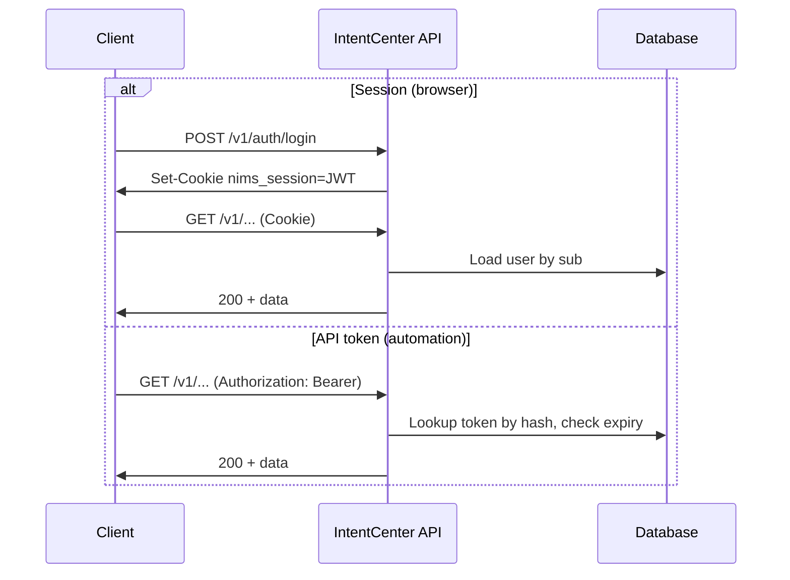

# Design: Token-based API authentication (REST + GraphQL)

**Status:** Draft  
**Last updated:** 2026-04-29  
**Related:** [Auth & user management (portal)](design-auth-user-management.md), [Architecture](architecture.md), [Platform README](../platform/README.md), [`platform/.env.example`](../platform/.env.example)

---

## 1. Summary

This document describes how **authenticated access** to the IntentCenter API should work, with emphasis on **token-based credentials** for non-browser clients. The platform already implements a **unified `AuthContext`**: an interactive user via an **HTTP-only session cookie** containing a **signed JWT**, and automation via an **opaque bearer token** stored only as a **hash** in the `ApiToken` table. The product goal is to keep **all business APIs unavailable to anonymous callers** except for a small, explicit **public allowlist**, and to make client behavior and security properties predictable for operators and integrators.

---

## 2. Goals

| Goal | Outcome |
|------|--------|
| **No silent anonymity** | Callers that omit valid credentials get **401 Unauthorized** on protected routes (or equivalent GraphQL error policy once aligned). |
| **Two first-class client types** | Browsers and scripts are both “authenticated,” using **cookie** vs **Authorization: Bearer** as appropriate. |
| **Clear token types** | Operators understand **session** (short-lived JWT in cookie) vs **API token** (long-lived secret, `ApiToken` row). |
| **Least exposure** | Raw API token values are shown **once** at creation; the server never stores or logs the plaintext secret. |
| **Same RBAC everywhere** | After identity is established, **READ / WRITE / ADMIN** rules match existing `User.role` and `Apitokenrole` usage. |

---

## 3. Non-goals (this document)

- Choosing or implementing a full external **OAuth2/OIDC authorization server** for third-party apps (covered in future IdP phases; see [portal auth design](design-auth-user-management.md)).
- **mTLS** or **IP allowlists** as the primary auth mechanism (optional deployment hardening, not a substitute for tokens).
- **Per-resource fine-grained ABAC** (remains a separate product decision).

---

## 4. Credential model

### 4.1 Session token (interactive users, browser)

| Aspect | Design |
|--------|--------|
| **Mechanism** | `POST /v1/auth/login` issues a **JWT** (`HS256`) stored in the **`nims_session` HTTP-only cookie** (`SameSite=Lax`, `Secure` when served over HTTPS). |
| **Claims** | `sub` = user UUID, `exp` = expiry (integer epoch). The server maps `sub` to `User` and `Organization_` on every request. |
| **Suitable for** | SPA and human-driven flows under `/app/`. |
| **Not suitable for** | Unattended jobs that cannot manage cookies, or third-party services that need a static secret (use an API token instead). |

### 4.2 API access token (automation, non-browser)

| Aspect | Design |
|--------|--------|
| **Mechanism** | `Authorization: Bearer <token>` (RFC 6750). Opaque, high-entropy value generated by the server at **`POST /v1/tokens`** (admin-gated in current model). |
| **Storage** | **SHA-256 hash** (or equivalent) of the token in `ApiToken.tokenHash`—lookup by hash only; no reversible storage. |
| **Scope** | **Organization** is implicit on the token record; **role** is the API token’s role (`Apitokenrole`: READ / WRITE / ADMIN in line with the schema). |
| **Lifecycle** | Optional `expiresAt`; **revocation** = delete or rotate the row (exact UX matches existing “tokens” settings flows). |
| **Suitable for** | CI, scripts, partner integrations, and any client that can send a header but not a cookie. |

### 4.3 Relationship to `GET /v1/me`

`auth.mode` should continue to reflect **`user`** (interactive session) vs **`api_token`** (bearer) so UIs and debugging stay consistent. Both modes resolve to the same **org-scoped `AuthContext`** for authorization.

---

## 5. Request resolution and precedence

Implementation today resolves credentials in `resolve_auth` (see `nims/deps.py`):

1. If `Authorization: Bearer` is present with a **non-empty** value, the server **only** attempts **API token** validation (hash lookup, expiry). An invalid or unknown bearer string yields **no auth**—it does not fall back to the session cookie in that request path.
2. Otherwise, if the **`nims_session`** cookie is present, the server validates the **JWT** and loads the `User`.

**Implication for clients:** A client must **not** send a stray `Authorization: Bearer ...` header together with a valid session unless the bearer is a valid org API token. Browsers and SPAs that attach both should clear unused bearer state when using cookie sessions (or use only one credential type per request). Automation clients should use **only** the bearer and omit the cookie.

---

## 6. Authorization after authentication

Authentication answers **who**; authorization answers **what they may do**. The platform’s existing model applies unchanged:

- **Session users** use **`User.role`** in the org.
- **API tokens** use **`Apitokenrole`** on the `ApiToken` row.
- **Mutations** go through `require_write` (or stricter) where applicable; **admin** actions through `require_admin` (e.g. token and user management).

A token with **READ** only must not perform writes; a **disabled user** or **expired** token must fail as **401** or **403** according to the existing `require_*` and user-active checks.

---

## 7. Public allowlist (unauthenticated)

These endpoints are intentionally public; everything else that exposes inventory, automation, or org data should require a valid `AuthContext`.

| Area | Rationale |
|------|-----------|
| **Health** | e.g. `GET /health` for load balancers. |
| **Auth bootstrap** | e.g. `GET /v1/auth/providers`, `POST /v1/auth/login` (and logout if idempotent and safe to expose unauthenticated). |
| **Static SPA shell** | HTML/JS for `/app/` if served by the API process. |
| **API documentation** | Optional: `/docs` / OpenAPI JSON may remain public in dev; production may require auth or a separate private host. |

Any new public route should be **reviewed** to ensure it does not leak org, user, or inventory data.

---

## 8. GraphQL

The read-only **GraphQL** surface (`/graphql`) should follow the same policy as REST: if the goal is “no anonymous data access,” the GraphQL context should **reject** unauthenticated operations (or return only empty/public data) in a way that is **documented and consistent**—not an accidental empty list while still returning 200. Align error shape with REST (**401** when not logged in) unless a deliberate public query exists.

---

## 9. Security controls

| Control | Design expectation |
|--------|-------------------|
| **Transport** | **HTTPS in production**; `Secure` cookie; reverse-proxy TLS termination documented in deployment. |
| **Token entropy** | API tokens are long random secrets; no short passwords used as API keys. |
| **Storage on client** | **Scripts:** env vars or secret managers, not repositories. **Browsers:** session in HTTP-only cookie; avoid duplicating long-lived tokens in `localStorage` if avoidable. |
| **CSRF** | Cookie sessions use **SameSite** and same-site API usage; for cross-site APIs, require **bearer** or add CSRF tokens—follow existing `apiFetch` + credentials plan. |
| **Rate limiting** | Apply to **login** and high-abuse paths (and optionally per-token) at the edge or app. |
| **Auditing** | Retain current actor attribution (`user:{id}` vs `api_token:{id}`) in audit events. |
| **Brute force** | Invalid API token and invalid session should be **indistinguishable** in logs (no “this user exists but token wrong” in API error bodies). |

---

## 10. Hardening checklist (implementation alignment)

When moving from “mostly protected” to **strict** authenticated-by-default:

1. **OpenAPI** lists which operations require `401`; verify each router uses `get_auth` + `require_auth_ctx` (or a shared dependency) for protected handlers.  
2. **No bypass** for optional query parameters or alternate paths.  
3. **CORS** remains compatible with `credentials: "include"` for the SPA; automation uses bearer without cookies.  
4. **Error consistency:** invalid/missing auth → **401**; valid auth but insufficient role → **403** where applicable.  
5. **GraphQL** and **bulk** import/export endpoints receive the same review as DCIM routes.

---

## 11. Sequences (high level)

---

## 12. Open questions

1. Should the OpenAPI / Swagger UI in production be **unauthenticated** or **admin-only**?  
2. Do we ever need **separate** API token **scopes** (e.g. read-only DCIM vs read-only IPAM) before full ABAC?  
3. Should **failed bearer** on a request that also had a valid session **fall back to session**, or is strict “Bearer wins, no fallback” preferred for security clarity?  
4. **Token binding:** optional `aud` or `client` claim in future for multi-tenant SaaS.

---

## 13. Acceptance criteria (for “authenticated-only” rollout)

- Unauthenticated `GET`/`POST` to a representative **inventory** endpoint without cookie or valid bearer returns **401**.  
- A valid **session** can read and mutate per role without sending `Authorization`.  
- A valid **API token** can do the same from a script with **only** `Authorization: Bearer`.  
- `GET /v1/me` reports **`user`** or **`api_token`** mode consistently.  
- Public allowlist is **enumerated in code or docs** and does not grow without review.  
- **GraphQL** either requires auth for data or documents the explicit public read policy.

---

## 14. References (normative for implementers)

- IETF **RFC 6750** (Bearer token HTTP usage)  
- OWASP **Token storage** and **CSRF** guidance for cookie-based sessions
