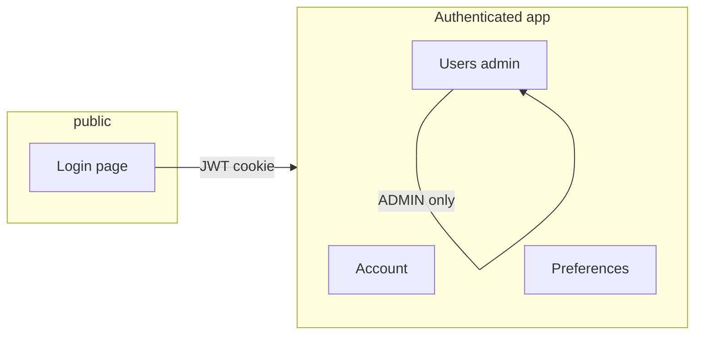

# Design: Auth & user management (portal)

**Status:** Draft  
**Last updated:** 2026-04-29  
**Related:** [Platform README](../platform/README.md), [Architecture](architecture.md), [API / token authentication](design-api-token-authentication.md), [`platform/.env.example`](../platform/.env.example)

---

## 1. Summary

This document plans a **basic authentication and user-management experience** for the IntentCenter **operator portal** (React console under `/app/`). It builds on the existing **local email/password** flow (`POST /v1/auth/login`, HTTP-only session cookie `nims_session`, `GET/PATCH /v1/me`) and the **organization-scoped user model** (role on `User`, `require_admin` for privileged API actions). The aim is a **small, coherent UI surface**: sign-in clarity, self-service profile/preferences, and **admin-only** user lifecycle within an organization—without duplicating a full enterprise IdP.

**Sign-in & identity (added 2026):** Organizations can configure **local email/password** (optional) and **at most one** external directory integration among **LDAP/Active Directory**, **Microsoft Entra ID (Azure AD)**, and **OpenID Connect**. Settings live in the database (`Organization.identityConfig`, JSON) and can be **overridden by environment variables** for deployments that prefer config-as-code. An **ADMIN**-only screen stores non-secret values in the UI, encrypts directory secrets at rest, and never ships plaintext IdP secrets to the browser. Interactive SSO redirect flows remain **out of band** (see `GET /v1/auth/sso/{provider}/start` status) until backend wiring is complete; the **provider catalog** and **identity** APIs reflect effective configuration.

---

## 2. Goals

| Goal | User-visible outcome |
|------|---------------------|
| **Trust** | Operators understand how they authenticate, who they are, and which organization context applies. |
| **Self-service** | Signed-in users can update **display name** and **preferences** (already partially supported via `PATCH /v1/me`) from the UI. |
| **Governance** | Org admins can **invite or create** users, assign **roles**, and **deactivate** accounts without database access. |
| **Consistency** | All privileged actions use the same **RBAC and audit** patterns as the rest of the API (`require_admin`, `require_write`, actor attribution). |
| **Future IdP** | UI and API shapes **do not block** Phase 2 full SSO (interactive redirects, token exchange, **JIT** provisioning). |
| **Config surfaces** | Operators can set **which** sign-in methods apply (UI + `AUTH_*`); interactive LDAP/OAuth flows are still **Phase 2** where not implemented. |

---

## 3. Non-goals (initial portal phases)

- Replacing the **authoritative identity system** for large enterprises (full SCIM, HR-driven provisioning, separate IdP admin UX).
- **Per-resource ABAC** beyond the existing coarse roles (READ / WRITE / ADMIN on `User` and API tokens)—that remains a platform-wide product decision.
- **Multi-organization** users (one identity, many org memberships) unless the data model is extended explicitly.
- **End-to-end** LDAP bind / OAuth redirect / callback / JIT user provisioning in production until the Phase 2 worker/bridge work is in place. The **catalog** and **admin identity** surfaces describe intent and configuration; broken SSO buttons are avoided when a provider is not **ready** per merged config.
- Treating the admin identity screen as a full **separate** IdP admin product (it is an operator convenience aligned with the API, not a replacement for Entra/LDAP consoles).

---

## 4. Current state (baseline)

| Area | Today |
|------|--------|
| **Sign-in** | `Login.tsx` posts to `POST /v1/auth/login`; JWT stored in **HTTP-only cookie** `nims_session`; logout via `POST /v1/auth/logout`. `POST /v1/auth/login` is rejected when **local** sign-in is disabled for the org (use SSO when wired). The login form is hidden if `GET /v1/auth/providers` reports the local provider as not enabled. |
| **Session context** | `GET /v1/me` returns organization, `auth.mode` (`user` vs `api_token`), user fields including **role** and **authProvider**. |
| **Preferences** | `PATCH /v1/me` with `{ "preferences": { ... } }` (interactive user only); supports pinned pages per [platform README](../platform/README.md). |
| **Bootstrap user** | Seed admin via `SEED_ADMIN_*` / `npm run db:seed` (see `.env.example`). |
| **Privileged API** | `require_admin` for operations such as API token creation, user management, and **identity settings**; `require_write` for mutating work. |
| **Identity storage** | `Organization.identityConfig` (JSON, **not** null; default `{}`). Migrations: `prisma/migrations/..._org_identity_config/`. **Apply migrations** on every environment that runs this code. |
| **Environment vs DB** | `AUTH_*` variables in [`platform/.env.example`](../platform/.env.example) **override** stored values for runtime and **lock** the corresponding admin UI (message: *Settings configured at the environment level can not be changed within the interface*; non-secrets may still be shown read-only; secrets are masked, never sent as cleartext from the server). |
| **Admin API** | `GET /v1/admin/identity`, `PATCH /v1/admin/identity` — `require_admin`, org from session; `PATCH` updates `identityConfig` and records audit metadata (no raw secrets in audit `after` blobs). |
| **Public provider catalog** | `GET /v1/auth/providers` — uses the **first** organization in the database plus **merged** env, returns `local` + `ldap` / `azure_ad` / `oidc` entries with `enabled` and `note` (e.g. another IdP selected, or configuration incomplete). |
| **IdP secret encryption** | Directory secrets in JSON use Fernet-style encryption (`nims/identity_crypto.py`); `IDENTITY_ENCRYPTION_KEY` optional, otherwise derived with `JWT_SECRET` for the legacy keying path. |
| **SSO** | `GET /v1/auth/sso/{provider}/start` returns **501** until the interactive SSO flow is implemented. |

### 4.1 Admin UI: Sign-in & identity

| Item | Behavior |
|------|----------|
| **Route** | `/platform/admin/identity` (under **Administration** with API tokens, users, audit, …) |
| **Access** | Same as other admin features: **ADMIN** interactive or API token with `ADMIN` role. |
| **Local** | **Checkbox** — *Allow sign-in with email and password* — can be on **at the same time** as one external directory. |
| **External** | **Radio** group — *No external directory* \| *LDAP* \| *Microsoft Entra* \| *OpenID Connect* — only **one** of LDAP / Entra / OIDC, or none. |
| **Panels** | Only the **selected** external type shows connection fields. A short “local only” blurb when external is *none* and the checkbox is on. |
| **Save** | **Save changes** is **enabled only when** there are **unsaved** edits (compare UI state to server on each render). |
| **Validation** | The API requires **at least one** of: local sign-in, or a non-`none` external provider. The UI shows a **banner** if both are off. |

**Backend invariants (aligned with `nims/services/identity_settings.py`):** exactly **one** of `none`, `ldap`, `azure_ad`, `oidc` as **external** provider; **local** is independent. Env-set values win over the database; patches that try to change env-locked fields are rejected with `400`.

### 4.2 Environment variable reference (identity)

Documented in [`platform/.env.example`](../platform/.env.example). Summary:

| Variable | Role |
|----------|------|
| `AUTH_LOCAL_ENABLED` | `true`/`1`/`yes` or `false` — toggles local email/password when set (overrides DB). |
| `AUTH_EXTERNAL_PROVIDER` | `none` \| `ldap` \| `azure_ad` \| `oidc` — which external type is active when set. |
| `AUTH_LDAP_*` | URL, bind DN, bind password, user search base, user search filter. |
| `AUTH_AZURE_TENANT_ID`, `AUTH_AZURE_CLIENT_ID`, `AUTH_AZURE_CLIENT_SECRET` | Microsoft Entra. |
| `AUTH_OIDC_*` | Issuer, client ID, client secret, redirect URI. |
| `IDENTITY_ENCRYPTION_KEY` | Optional; strengthens at-rest secret blobs in `identityConfig`. |

### 4.3 Implementation pointers (code)

| Concern | Location |
|---------|----------|
| Identity merge, admin JSON, public catalog | `platform/backend/nims/services/identity_settings.py` |
| Admin routes | `platform/backend/nims/routers/v1/identity_admin.py` (mounted at `/v1/…`) |
| `GET /v1/auth/providers` | `platform/backend/nims/routers/v1/auth.py` |
| Admin React page | `platform/web/src/pages/platform/IdentityPage.tsx` |
| `Organization` model & migration | `platform/prisma/schema.prisma`, `nims.models_generated.Organization` |

---

## 5. Personas and scenarios

| Persona | Scenario | Portal behavior |
|---------|----------|-----------------|
| **Operator** | Daily work in DCIM lists and object views | Stays signed in; session cookie; optional “Account” entry for profile. |
| **Org admin** | Onboard teammates, revoke access | **Users** (or **Organization → Users**) area: list/create/edit/deactivate users; assign roles. |
| **Security / compliance** | Review who can change inventory | Rely on **audit events** (existing pipeline) keyed by actor `user:{id}`; future: filter by user in audit UI. |
| **Automation** | Scripts use API tokens | Unchanged; token management stays under existing **Settings** / `POST /v1/tokens` patterns—not mixed into “human user” CRUD. |

---

## 6. Information architecture (portal)

Suggested **navigation** additions (exact labels can match existing sidebar patterns):

1. **Account** (all authenticated interactive users)  
   - Profile: email (read-only if local login identity), **display name** (editable).  
   - **Change password** (local provider only): current password, new password, strength hint.  
   - **Preferences**: continuation of pinned pages / theme keys already stored in `User.preferences`.  
   - **Session**: sign out (calls existing logout).

2. **Organization → Users** (role **ADMIN** only)  
   - Table: email, display name, role, status (active/inactive), auth provider, last updated.  
   - Actions: **Add user**, **Edit**, **Deactivate** (soft) / **Reactivate**.  
   - Optional later: **Reset password** (admin-triggered email or one-time link—depends on mail infrastructure).

3. **Administration → Sign-in & identity** (role **ADMIN** only)  
   - Configure local email/password (checkbox) and **one** of none/LDAP/Entra/OIDC (radios) with the matching connection fields. Env overrides are read-only in the UI with a clear message.

4. **Sign-in page**  
   - Minimal email/password when local sign-in is enabled. **Other sign-in options** list from `GET /v1/auth/providers` — non-local providers show disabled buttons with `note` / title until the SSO flow is implemented; avoid implying a broken redirect.

---

## 7. Functional requirements

### 7.1 Self-service (any signed-in user)

- Display data from `GET /v1/me` in a dedicated **Account** view.  
- **Display name**: editable field persisted via API (new `PATCH /v1/me` field or dedicated endpoint—see §8).  
- **Password change** (local users only): verify current password, set new hash on server, **invalidate other sessions** optionally (product choice).  
- **Preferences**: existing JSON merge via `PATCH /v1/me`—surface pinned pages UI consistently with current behavior.

### 7.2 Admin user management

- **List users** in the same organization as the admin (paginated, searchable by email).  
- **Create user**: email, display name, initial role, optional temporary password or invite flow.  
- **Update user**: display name, role; restrict demoting the **last ADMIN** (guardrail).  
- **Deactivate**: set a `deletedAt` or `isActive` flag consistent with the Prisma schema; block login with a clear error.  
- **Audit**: all mutations emit audit events with actor `user:{adminId}`.

### 7.3 Authorization matrix (UI)

| Action | READ | WRITE | ADMIN |
|--------|------|-------|-------|
| View app (read inventory) | ✓ | ✓ | ✓ |
| Mutate inventory | ✗ | ✓ | ✓ |
| Account / preferences | ✓ | ✓ | ✓ |
| API tokens (`POST /v1/tokens`) | ✗ | ✗ | ✓ |
| User management UI | ✗ | ✗ | ✓ |

(Align strictly with `Apitokenrole` and `User.role` in the backend.)

---

## 8. API additions (planned)

Existing endpoints remain the **source of truth** for session and preferences. Planned additions (names illustrative—align with OpenAPI and routing conventions in `routers/v1/`):

| Method | Path | Purpose |
|--------|------|---------|
| `PATCH` | `/v1/me` | Extend body: optional `displayName` (and keep `preferences`). |
| `POST` | `/v1/me/password` | Body: `currentPassword`, `newPassword` — local users only. |
| `GET` | `/v1/users` | Admin: list users in org (query: `q`, `limit`, `cursor`). |
| `POST` | `/v1/users` | Admin: create user. |
| `GET` | `/v1/users/{id}` | Admin: user detail. |
| `PATCH` | `/v1/users/{id}` | Admin: update role, display name, active flag. |
| `GET` | `/v1/admin/identity` | Admin: effective identity (merged env + `Organization.identityConfig`); no plaintext IdP secrets to the client. |
| `PATCH` | `/v1/admin/identity` | Admin: update `identityConfig`; env-locked fields rejected; audit event without raw secrets. |

**Implementation notes**

- All `/v1/users*` and `/v1/admin/identity` routes use `require_admin` and scope by `auth.organization.id` (and the org attached to the signed-in user or admin API token).  
- Password hashing: reuse **bcrypt** as in `post_login`.  
- Return shapes should mirror login’s user summary where helpful for the UI cache.

---

## 9. Security and UX guardrails

- **HTTPS** in production (`secure` cookie already tied to `node_env`).  
- **Rate limiting** on login and password change (middleware or reverse proxy—document deployment expectation).  
- **Generic errors** on login failure (“Invalid email or password”)—keep to avoid account enumeration; admin UI may show emails for org members (authenticated channel).  
- **CSRF**: cookie-based sessions imply **SameSite=Lax** and careful handling of mutating requests from the SPA; align with existing `apiFetch` / credentials behavior.  
- **Last admin**: server-side check before role demotion or deactivation.  
- **SSO users**: disable or hide **password change** when `authProvider` ≠ local.

---

## 10. UI components (implementation sketch)

Reuse existing shell patterns: `AppShell`, table primitives (`DataTable`), forms consistent with `Login.tsx` styling (charcoal chrome, amber accents per docs site alignment).

---

## 11. Phasing

| Phase | Scope |
|-------|--------|
| **MVP** | Account page (read `GET /v1/me`, edit display name + preferences), password change for local users, **Users** list + create + role assign + deactivate (ADMIN). |
| **In progress** | **Sign-in & identity** admin page + `identityConfig` + `AUTH_*` merge (this document §4.1). Full LDAP/OAuth execution remains Phase 2. |
| **Next** | Invite-by-email, forced password reset, admin “impersonation” (optional, high risk—likely never default). |
| **With Phase 2 IdP** | Wire `GET /v1/auth/sso/{provider}/start`, callback, and **Just-In-Time** user provisioning into the same org model; enable SSO **Continue** when `GET /v1/auth/providers` marks a provider `enabled: true` and the backend route returns redirect instead of **501**. |

---

## 12. Open questions

1. **Email verification** for new local users: required for production or optional?  
2. **Password policy** complexity (length, rotation)—central config vs environment?  
3. **Inactive users**: hard delete vs soft delete vs archive—must match compliance and audit retention.  
4. Should **WRITE** users see **read-only** user directory for collaboration, or is user list **ADMIN-only** entirely?

---

## 13. Acceptance criteria (MVP)

- An **ADMIN** can create a second user, assign **WRITE**, and that user can sign in and perform writes per RBAC.  
- An **ADMIN** can deactivate a user; that user can no longer sign in.  
- A signed-in user can change **display name** and **preferences** without SQL.  
- A **local** user can change password from the portal; session remains valid or is clearly re-established.  
- All new mutating endpoints enforce **org scope** and **admin** where specified; audit trail records actor.  
- An **ADMIN** can read and update **identity** settings (subject to env lock rules); at least one sign-in path remains after each valid save.  
- `GET /v1/auth/providers` and the login page stay consistent with merged configuration (no silent mismatch between admin UI and unauthenticated provider list for the first organization).
