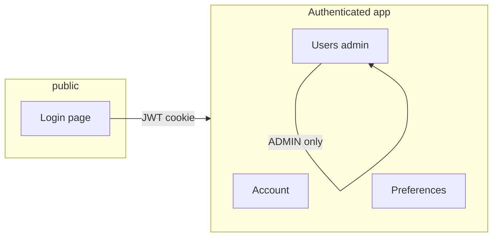

# Design: Auth & user management (portal)

**Status:** Draft  
**Last updated:** 2026-04-21  
**Related:** [Platform README](../platform/README.md), [Architecture](architecture.md), [`platform/.env.example`](../platform/.env.example)

---

## 1. Summary

This document plans a **basic authentication and user-management experience** for the IntentCenter **operator portal** (React console under `/app/`). It builds on the existing **local email/password** flow (`POST /v1/auth/login`, HTTP-only session cookie `nims_session`, `GET/PATCH /v1/me`) and the **organization-scoped user model** (role on `User`, `require_admin` for privileged API actions). The aim is a **small, coherent UI surface**: sign-in clarity, self-service profile/preferences, and **admin-only** user lifecycle within an organization—without duplicating a full enterprise IdP.

---

## 2. Goals

| Goal | User-visible outcome |
|------|---------------------|
| **Trust** | Operators understand how they authenticate, who they are, and which organization context applies. |
| **Self-service** | Signed-in users can update **display name** and **preferences** (already partially supported via `PATCH /v1/me`) from the UI. |
| **Governance** | Org admins can **invite or create** users, assign **roles**, and **deactivate** accounts without database access. |
| **Consistency** | All privileged actions use the same **RBAC and audit** patterns as the rest of the API (`require_admin`, `require_write`, actor attribution). |
| **Future IdP** | UI and API shapes **do not block** Phase 2 SSO/OIDC (`/v1/auth/providers`, `/v1/auth/sso/{provider}/start` placeholders). |

---

## 3. Non-goals (initial portal phases)

- Replacing the **authoritative identity system** for large enterprises (full SCIM, HR-driven provisioning, separate IdP admin UX).
- **Per-resource ABAC** beyond the existing coarse roles (READ / WRITE / ADMIN on `User` and API tokens)—that remains a platform-wide product decision.
- **Multi-organization** users (one identity, many org memberships) unless the data model is extended explicitly.
- **LDAP / Azure AD / OIDC** interactive flows until Phase 2 backend wiring is complete; the portal may **surface** provider status from `GET /v1/auth/providers` without enabling broken redirects.

---

## 4. Current state (baseline)

| Area | Today |
|------|--------|
| **Sign-in** | `Login.tsx` posts to `POST /v1/auth/login`; JWT stored in **HTTP-only cookie** `nims_session`; logout via `POST /v1/auth/logout`. |
| **Session context** | `GET /v1/me` returns organization, `auth.mode` (`user` vs `api_token`), user fields including **role** and **authProvider**. |
| **Preferences** | `PATCH /v1/me` with `{ "preferences": { ... } }` (interactive user only); supports pinned pages per [platform README](../platform/README.md). |
| **Bootstrap user** | Seed admin via `SEED_ADMIN_*` / `npm run db:seed` (see `.env.example`). |
| **Privileged API** | `require_admin` for operations such as API token creation; `require_write` for mutating work. |
| **SSO** | `GET /v1/auth/providers` advertises local + future IdPs; `GET /v1/auth/sso/{provider}/start` returns **501** until implemented. |

---

## 5. Personas and scenarios

| Persona | Scenario | Portal behavior |
|---------|----------|-----------------|
| **Operator** | Daily work in DCIM lists and object views | Stays signed in; session cookie; optional “Account” entry for profile. |
| **Org admin** | Onboard teammates, revoke access | **Users** (or **Organization → Users**) area: list/create/edit/deactivate users; assign roles. |
| **Security / compliance** | Review who can change inventory | Rely on **audit events** (existing pipeline) keyed by actor `user:{id}`; future: filter by user in audit UI. |
| **Automation** | Scripts use API tokens | Unchanged; token management stays under existing **Settings** / `POST /v1/tokens` patterns—not mixed into “human user” CRUD. |

---

## 6. Information architecture (portal)

Suggested **navigation** additions (exact labels can match existing sidebar patterns):

1. **Account** (all authenticated interactive users)  
   - Profile: email (read-only if local login identity), **display name** (editable).  
   - **Change password** (local provider only): current password, new password, strength hint.  
   - **Preferences**: continuation of pinned pages / theme keys already stored in `User.preferences`.  
   - **Session**: sign out (calls existing logout).

2. **Organization → Users** (role **ADMIN** only)  
   - Table: email, display name, role, status (active/inactive), auth provider, last updated.  
   - Actions: **Add user**, **Edit**, **Deactivate** (soft) / **Reactivate**.  
   - Optional later: **Reset password** (admin-triggered email or one-time link—depends on mail infrastructure).

3. **Sign-in page**  
   - Keep minimal; optionally show **read-only** “SSO coming soon” or disabled buttons when `GET /v1/auth/providers` returns `enabled: false` for non-local providers—avoid dead-end clicks.

---

## 7. Functional requirements

### 7.1 Self-service (any signed-in user)

- Display data from `GET /v1/me` in a dedicated **Account** view.  
- **Display name**: editable field persisted via API (new `PATCH /v1/me` field or dedicated endpoint—see §8).  
- **Password change** (local users only): verify current password, set new hash on server, **invalidate other sessions** optionally (product choice).  
- **Preferences**: existing JSON merge via `PATCH /v1/me`—surface pinned pages UI consistently with current behavior.

### 7.2 Admin user management

- **List users** in the same organization as the admin (paginated, searchable by email).  
- **Create user**: email, display name, initial role, optional temporary password or invite flow.  
- **Update user**: display name, role; restrict demoting the **last ADMIN** (guardrail).  
- **Deactivate**: set a `deletedAt` or `isActive` flag consistent with the Prisma schema; block login with a clear error.  
- **Audit**: all mutations emit audit events with actor `user:{adminId}`.

### 7.3 Authorization matrix (UI)

| Action | READ | WRITE | ADMIN |
|--------|------|-------|-------|
| View app (read inventory) | ✓ | ✓ | ✓ |
| Mutate inventory | ✗ | ✓ | ✓ |
| Account / preferences | ✓ | ✓ | ✓ |
| API tokens (`POST /v1/tokens`) | ✗ | ✗ | ✓ |
| User management UI | ✗ | ✗ | ✓ |

(Align strictly with `Apitokenrole` and `User.role` in the backend.)

---

## 8. API additions (planned)

Existing endpoints remain the **source of truth** for session and preferences. Planned additions (names illustrative—align with OpenAPI and routing conventions in `routers/v1/`):

| Method | Path | Purpose |
|--------|------|---------|
| `PATCH` | `/v1/me` | Extend body: optional `displayName` (and keep `preferences`). |
| `POST` | `/v1/me/password` | Body: `currentPassword`, `newPassword` — local users only. |
| `GET` | `/v1/users` | Admin: list users in org (query: `q`, `limit`, `cursor`). |
| `POST` | `/v1/users` | Admin: create user. |
| `GET` | `/v1/users/{id}` | Admin: user detail. |
| `PATCH` | `/v1/users/{id}` | Admin: update role, display name, active flag. |

**Implementation notes**

- All `/v1/users*` routes use `require_admin` and scope by `auth.organization.id`.  
- Password hashing: reuse **bcrypt** as in `post_login`.  
- Return shapes should mirror login’s user summary where helpful for the UI cache.

---

## 9. Security and UX guardrails

- **HTTPS** in production (`secure` cookie already tied to `node_env`).  
- **Rate limiting** on login and password change (middleware or reverse proxy—document deployment expectation).  
- **Generic errors** on login failure (“Invalid email or password”)—keep to avoid account enumeration; admin UI may show emails for org members (authenticated channel).  
- **CSRF**: cookie-based sessions imply **SameSite=Lax** and careful handling of mutating requests from the SPA; align with existing `apiFetch` / credentials behavior.  
- **Last admin**: server-side check before role demotion or deactivation.  
- **SSO users**: disable or hide **password change** when `authProvider` ≠ local.

---

## 10. UI components (implementation sketch)

Reuse existing shell patterns: `AppShell`, table primitives (`DataTable`), forms consistent with `Login.tsx` styling (charcoal chrome, amber accents per docs site alignment).

---

## 11. Phasing

| Phase | Scope |
|-------|--------|
| **MVP** | Account page (read `GET /v1/me`, edit display name + preferences), password change for local users, **Users** list + create + role assign + deactivate (ADMIN). |
| **Next** | Invite-by-email, forced password reset, admin “impersonation” (optional, high risk—likely never default). |
| **With Phase 2 IdP** | Wire `GET /v1/auth/sso/{provider}/start`, callback, and **Just-In-Time** user provisioning into the same org model; portal shows SSO buttons when `enabled: true`. |

---

## 12. Open questions

1. **Email verification** for new local users: required for production or optional?  
2. **Password policy** complexity (length, rotation)—central config vs environment?  
3. **Inactive users**: hard delete vs soft delete vs archive—must match compliance and audit retention.  
4. Should **WRITE** users see **read-only** user directory for collaboration, or is user list **ADMIN-only** entirely?

---

## 13. Acceptance criteria (MVP)

- An **ADMIN** can create a second user, assign **WRITE**, and that user can sign in and perform writes per RBAC.  
- An **ADMIN** can deactivate a user; that user can no longer sign in.  
- A signed-in user can change **display name** and **preferences** without SQL.  
- A **local** user can change password from the portal; session remains valid or is clearly re-established.  
- All new mutating endpoints enforce **org scope** and **admin** where specified; audit trail records actor.
