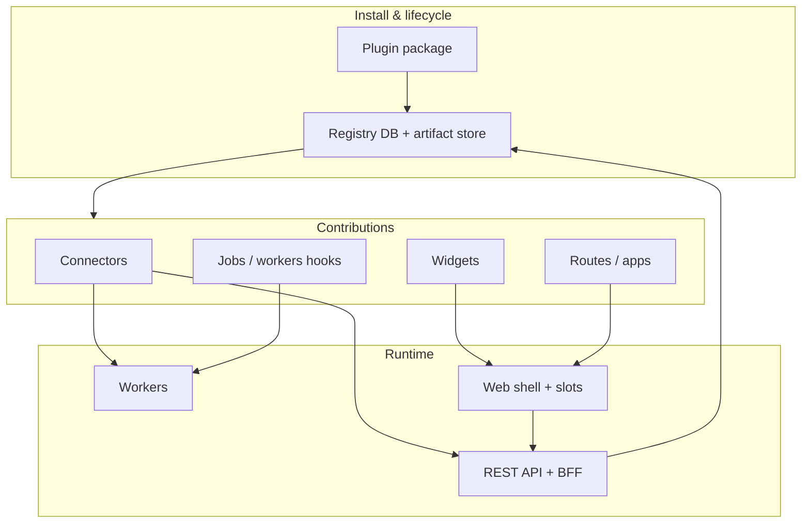

# Design: Pluggable extensions — connectors, apps, widgets, and page macros

**Status:** Draft (planning)  
**Last updated:** 2026-04-21  
**Related:** [Architecture & design visuals](architecture.md), [Design: LLM assistant](design-llm-assistant.md), [Platform README](../platform/README.md), [Clean-room: extensions & registry](../cleanroom/source-a/11-extensions-plugins-and-registry.md)

---

## 1. Summary

This document plans a **first-class extensibility layer** for IntentCenter so operators can **install** packaged capabilities (integrations and UI additions), **place widgets** on named pages or page patterns without forking core, and **bind page-local data** into those widgets through a small **macro** language operating on a stable **page context** model.

The goal is to converge **product modularity** (what ships together), **runtime composition** (what appears where), and **data flow** (how a widget receives `resourceType`, ids, and related records) under one coherent contract—while preserving **tenant isolation**, **RBAC**, and **auditability**.

---

## 2. Terminology

| Term | Meaning |
|------|---------|
| **Connector** | An outbound or bidirectional **integration** to an external system (REST, webhooks, SNMP-adjacent collectors, cloud APIs). Usually has credentials, rate limits, and maps external objects to inventory concepts. Runs primarily on the **API / worker** tier, not in the browser. |
| **Plugin** | A **versioned package** registered with the platform that may contribute **connectors**, **widgets**, **routes**, **jobs**, and **API extensions**. It is the unit of install, upgrade, enable/disable, and compatibility checks. Aligns with existing `PluginRegistration` (today metadata-only; this plan extends behavior). |
| **App** (UI app) | A **coherent UI surface** contributed by a plugin: one or more routes, navigation entries, and optional settings. May embed **widgets** on core pages *and* ship full pages for configuration or deep workflows. |
| **Widget** | A **small UI component** with a declared **placement** (which page or slot) and a declared **data contract** (which fields from page context / macros it needs). May be React code shipped with core (built-in), loaded as a **remote module** (federated), or rendered in a **sandboxed** frame for third parties. |
| **Page** (logical) | A **stable identifier** in a **page registry**, independent of URL churn. Example: `dcim.device.detail` rather than only `/dcim/devices/:id`. Routes map to page IDs; plugins target page IDs. |
| **Slot** | A named region within a page layout (`header.actions`, `sidebar`, `main.afterPrimary`) where widgets may render in **priority order**. |
| **Page context** | A **structured object** the shell builds for the active route: route params, resolved resource type/id, optional loaded record summary, org id, and capability flags. This is the **single source of truth** for macros. |
| **Macro** | A **template expression** evaluated against page context (and optionally approved API fetches) to produce strings or small JSON payloads for widget props—e.g. `{{ page.resourceId }}` or `{{ resource.name }}` when `resource` is in context. |
| **Job (automation)** | A **JobDefinition** (org-scoped `key`, optional approval) plus **JobRun** executions with structured `input` / `output` JSON. Workers (or the API orchestration layer) perform side effects **on behalf of** a user or schedule; this is the main **automation** primitive alongside **ChangeRequest** and **webhooks**. |

---

## 3. Goals

| Goal | Outcome |
|------|---------|
| **Composable UI** | Core pages expose **slots**; widgets attach by **configuration + manifest**, not by editing core React for each integration. |
| **Explicit data flow** | Widgets do not scrape the DOM; they receive **typed inputs** derived from **page context** and **declared macro bindings**. |
| **Safe third-party surface** | Optional **sandboxing** and **permission scopes** for widgets/connectors that are not full trust. |
| **Operability** | Install, enable/disable, upgrade, and **introspection** (what a plugin contributes) are visible to admins and support. |
| **Alignment with architecture** | Fits the [extensibility block](architecture.md) (plugin host + registry) and keeps the **API as the authority** for writes. |

---

## 4. Non-goals (initial phases)

- Arbitrary **server-side code upload** from tenants (no unreviewed Python in the hot path). Prefer **signed packages**, **worker-isolated** connectors, or **vendor-maintained** images.
- Letting widgets **bypass RBAC** or call arbitrary internal endpoints without explicit **capability grants**.
- Replacing the entire SPA with a fully dynamic router **without** a curated page registry (stability and security suffer if every route is a string from the DB).

---

## 5. Current state in the codebase (gap analysis)

| Area | Today | Gap vs target |
|------|--------|----------------|
| **Plugin registry** | `PluginRegistration` stores `packageName`, `version`, `enabled`, optional `manifest` JSON ([schema](../platform/prisma/schema.prisma)). `GET /v1/plugins` lists registrations. | No enforcement of manifest schema, no download/install pipeline, no per-tenant enablement story beyond global row. |
| **Web routing** | Central `Routes` in [`App.tsx`](../platform/web/src/App.tsx) with static imports. | No dynamic route registration; no page IDs; no slot system. |
| **Per-object extensions** | `ResourceExtension` + templates/custom attributes ([`core.py` resource-extensions](../platform/backend/nims/routers/v1/core.py)). | Data-side extension only; not a general widget or macro system for arbitrary pages. |
| **LLM design** | Page context for tools ([`design-llm-assistant.md`](design-llm-assistant.md)). | Same **route + resource** context can be **shared** with widget macros to avoid two parallel context models. |
| **Jobs / automation** | `JobDefinition` + `JobRun` ([`automation` router](../platform/backend/nims/routers/v1/automation.py)); UI under **Platform → Jobs**. | No link yet between **plugin-contributed job keys** and worker implementations; no standard **widget → run job** binding with macro-built `input`. |

---

## 6. Target architecture

### 6.1 Layered model

1. **Install** validates signature, compatibility, and records manifest in `PluginRegistration` (and per-org overrides later).
2. **Contributions** are **declarative** in the manifest; the platform **materializes** them into registry tables or build-time bundles.
3. **Runtime** merges core + enabled contributions: API exposes connector actions; web shell resolves **page → slots → widgets**; workers run connector sync jobs.

### 6.2 Page registry and modular pages

Introduce a **versioned page registry** (could start as a static JSON/TS module shipped with core, later mirrored or extended via API):

- **`pageId`** — stable string (`inventory.objectView`, `dcim.device.list`, …).
- **`routePattern`** — link to React Router patterns (for validation and deep links).
- **`contextSchema`** — JSON Schema describing **page context** fields the shell guarantees when this page is active (params, `resourceType`, optional loaded entity summary).

**Core pages** register themselves once; **plugin apps** add new `pageId`s for their own routes. Widgets **declare** `pageId` + `slot` + optional **match rules** (e.g. only when `resourceType === 'device'`).

This answers “which pages a widget shows up on” without hardcoding paths in the widget—**page identity is stable**, URLs can evolve.

### 6.3 Slots and placement

Each page layout component (e.g. object view, device detail) renders **named slots**. Example:

| Slot | Typical use |
|------|-------------|
| `toolbar.secondary` | Actions adjacent to primary actions |
| `content.aside` | Right rail on wide layouts |
| `content.footer` | Secondary panels |

Placement rules in the manifest:

- `pageId` + `slot` + **priority** (integer)
- Optional **filters**: `resourceTypes`, `catalogSlug`, feature flags

The shell queries **`GET /v1/ui/placements?organizationId=…`** (or includes placements in bootstrap config) and renders matching widgets in order.

### 6.4 Widget kinds (implementation options)

| Kind | Pros | Cons |
|------|------|------|
| **A. Built-in / same bundle** | Simplest, full React, no CSP pain | Requires rebuild or dynamic import map for third parties |
| **B. Module federation / ESM remote** | True plugin UI without full rebuild | Build tooling, version skew, security review |
| **C. iframe + `postMessage`** | Strong isolation for untrusted vendors | UX and context passing more work |

**Recommendation:** Phase 1 — **A** for internal and first-party plugins (widgets compiled into or lazy-loaded from known URLs). Phase 2 — **B** for signed partners; **C** for strict enterprise “we don’t run your JS in our origin.”

### 6.5 Macros: feeding page data into widgets

**Principle:** Macros are **pure functions of page context** plus **explicit, read-only fetches** approved in the manifest.

**Layers:**

1. **Built-in context** — Always available: `organization`, `route.params`, `pageId`, `user` (id, roles), `resourceType` / `resourceId` when applicable.
2. **Resolved resource** — Optional: shell or a small hook loads a **minimal DTO** (e.g. device name, site) for the current object view; exposed as `resource` in macro scope.
3. **Macro syntax** — Start minimal: `{{ dot.path }}` with a defined whitelist of roots (`page`, `resource`, `user`). Escape by default; no arbitrary JS in v1.
4. **Advanced (later)** — Pipelines: `{{ resource.id \| upper }}`, or `{{ api.get('/v1/...') }}` only if the widget’s manifest lists **allowed GET paths** (server-enforced).

**Relation to LLM tools:** The same **page context** object (route, `resourceType`, `id`) should feed both **copilot tools** and **widget macros** so operators see consistent behavior.

### 6.6 Connectors vs widgets

- **Connectors** implement **sync**, **webhooks**, **credentials**, and **background jobs**; they surface status in **settings** and optionally feed **widgets** via APIs (widget calls `GET` endpoints, not the connector directly in-browser secrets).
- **Widgets** are **presentation + light orchestration**; secrets stay server-side.

### 6.7 Jobs and automation (how they fit)

**Role in the stack:** Jobs are the **durable execution** layer: anything that must run **asynchronously**, **retriably**, under **approval**, or on a **schedule** should map to **JobDefinition** + **JobRun** (and related **ChangeRequest** flows where policy requires). That is orthogonal to **widgets** (rendering) but connected through **actions** and **inputs**.

**Plugins** fit here in three ways:

| Mechanism | Description |
|-----------|-------------|
| **Contributed job definitions** | A plugin’s manifest declares one or more **org-scoped job keys** (metadata: name, description, `requiresApproval`, default schedule hints). On install, the platform **materializes** `JobDefinition` rows (or links them to a plugin id) so the Jobs UI and API stay consistent. |
| **Worker implementations** | Each `key` resolves to a **handler** in the worker process (or a sandboxed adapter). Third-party code is either **signed**, **vendor-shipped** in a controlled image, or **not** uploaded as raw tenant Python—same rule as connectors. |
| **Connector backends** | A connector’s sync/pull/push is typically **invoked by** a job run (scheduled or manual). The connector holds **credentials**; the job run carries **correlation id**, **input** (e.g. scope), and **output** (stats, errors). |

**Widgets** should **not** embed secrets or call connectors directly. They **trigger** automation by calling existing **mutating APIs**—for jobs, that means something like `POST /v1/jobs/{key}/run` with an **input** object. **Macros** build that JSON from page context, e.g. `{"deviceId": "{{ resource.id }}"}`, validated against a schema advertised by the job definition. RBAC applies the same as for any other write: the widget only shows the action if the user may run that job.

**Events:** Inbound **webhooks** or domain **events** can **enqueue** a job run (deduped via `idempotencyKey` where applicable), keeping the “intent in DB, execution in worker” split from [architecture](architecture.md).

**Mental model:** **Widget** = *when/where* in the UI and *what context*; **Job** = *what runs* asynchronously and *what was attempted* (runs, logs, approval). **Connector** = *how* external systems are reached, usually *behind* jobs.

---

## 7. Security and governance

| Concern | Mitigation |
|---------|------------|
| **RBAC** | Each widget declares `requiredPermissions`; shell hides or disables if missing. API endpoints remain authoritative. |
| **Tenant isolation** | Placements and connector config are **org-scoped**; manifest cannot reference other orgs. |
| **Supply chain** | Signed packages, pinned versions, optional **allowlist** of plugin publishers per deployment. |
| **XSS / data exfil** | Sanitize macro output; CSP for remote scripts; iframe sandbox when used. |
| **Audit** | Log enable/disable, config changes, and (for sensitive connectors) job runs (existing audit patterns extend). |

---

## 8. Data model (evolution)

Incremental extensions beyond current `PluginRegistration`:

- **`PluginPlacement`** (or embedded JSON array in manifest with normalized table for query): `organizationId`, `pluginId`, `pageId`, `slot`, `widgetKey`, `priority`, `filters`, `macroBindings` (JSON).
- **`ConnectorRegistration`**: `organizationId`, `pluginId`, `type`, encrypted config ref, health, rate limits.
- Optional: **`WidgetDefinition`** if widgets are registered independently of a single plugin (shared widgets).

Start with **manifest + migration** that populates rows; avoid big-bang schema before the first vertical slice is chosen.

---

## 9. API sketch (illustrative)

| Method | Purpose |
|--------|---------|
| `GET /v1/plugins` | Already exists; extend item shape with **contributions summary** from manifest. |
| `POST /v1/plugins/install` | Upload/activate package (admin); validates manifest. |
| `GET /v1/ui/page-registry` | Page metadata for shell (or static file + ETag). |
| `GET /v1/ui/placements` | Enabled widgets for org + optional `pageId` filter. |
| Connector CRUD | Under `/v1/connectors/...` with **scoped** secrets storage. |

Exact paths should follow existing `/v1` conventions in [`platform/backend`](../platform/backend).

---

## 10. Web shell work

1. **`PageContextProvider`** — Builds context from `useParams`, `useLocation`, and resource loaders; matches `pageId` from registry.
2. **`<Slot name="…" />`** — Resolves placements, sorts by priority, passes **evaluated macro props** into each widget component.
3. **Dynamic routes** — Optional `Route` entries from registry for plugin apps (`/apps/:pluginSlug/...`) or a catch-all that loads a plugin **app host** component.
4. **Navigation** — Merge core `AppShell` nav with **contributions** from `GET /v1/ui/navigation` (future).

---

## 11. Phased roadmap

| Phase | Scope | Deliverable |
|-------|--------|-------------|
| **0 — Foundations** | Formalize **manifest JSON Schema**; document **page registry** for existing routes only; no third-party UI. | Design review + static registry in repo. |
| **1 — Internal widgets** | 1–2 slots on **ObjectView** (or device detail) + **built-in** demo widget; **macro v1** (`page`, `resource`); placements stored in DB, toggled per org. | End-to-end: registry → API → shell → widget. |
| **2 — Connectors** | One connector type (e.g. webhook or generic REST pull) with worker job + settings UI; widgets read only via public GET APIs. | Prove server-side extensibility without opening arbitrary code upload. |
| **3 — Packaged plugins** | Install pipeline, signing, enable/disable, version upgrade rules; optional federation for UI. | Partner-ready lifecycle. |
| **4 — Advanced macros** | Pipelines, approved `api.*` helpers, richer filters; alignment with LLM tool context. | Power users, still audited. |

---

## 12. Open questions

1. **Global vs org-scoped plugins** — Is `PluginRegistration` global with per-org **enablement**, or one row per org install?
2. **Multi-region** — Manifest and artifacts in **object storage** with replication; registry DB regional or global?
3. **GraphQL** — Will read-heavy widgets prefer GraphQL vs REST; does the macro layer need GraphQL field allowlists?
4. **Marketplace vs private** — Same manifest format for both; different signing keys and review workflows.

---

## 13. Success criteria

- An admin can **enable a plugin** and see a **widget** appear only on **configured pages** (e.g. object view for certain resource types) without a core code change.
- Widget inputs are **traceable**: show **macro + context** in dev tools or a debug panel (supportability).
- Connectors **never** expose raw secrets to the browser; widgets use **documented APIs** only.

---

## Document history

| Date | Change |
|------|--------|
| 2026-04-21 | Initial plan drafted from architecture, existing plugin registry, and web routing structure. |
| 2026-04-21 | Added §6.7 and terminology for **jobs/automation** vs widgets and connectors; gap analysis row for jobs. |
