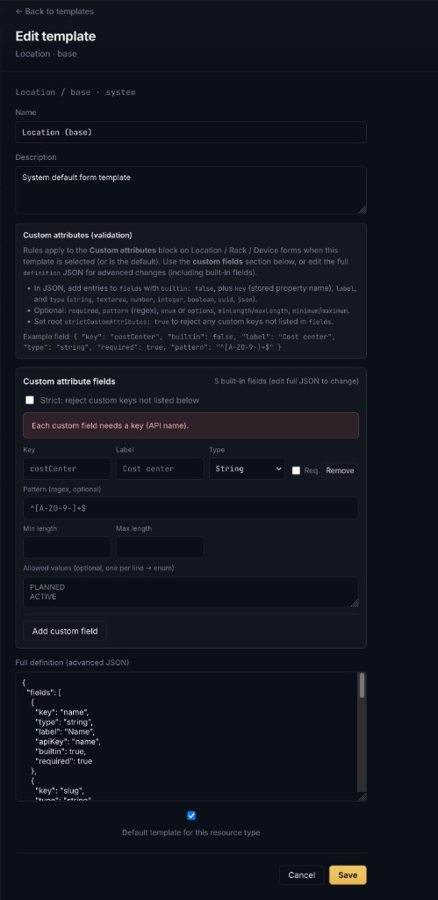

# Design: Modular, shared API and UI validation

**Status:** Active (core pieces implemented; extensions ongoing)  
**Last updated:** 2026-04-30  
**Related:** [Architecture](architecture.md), [Extensibility (plugins & widgets)](design-extensibility-plugins-widgets.md), [`platform/backend`](../platform/backend/) (FastAPI + Pydantic), [`platform/web`](../platform/web/) (React + TypeScript)

---

## 1. Summary

This document plans a **modular validation system** so that **mutating API inputs** (create/update bodies, query parameters where relevant) are checked against **consistent rules**: required fields, formats (including regex), ranges, cross-field logic, and **referential checks** (value exists in another dataset in the system). The same **declarative rules** must drive **immediate feedback in the operator console** at entry time, without maintaining a parallel hand-written validation layer on the frontend.

**Core principle:** one **authoritative definition** of “what is valid” per operation or resource shape; the **server always enforces** it; the **client consumes the same definition** for UX (inline errors, disabled submit, async hints).

---

## 2. Goals

| Goal | Outcome |
|------|---------|
| **Single source of truth** | Validation rules are defined once and applied on the API; the UI does not invent duplicate regex/required logic. |
| **Modularity** | Rules compose from small pieces (field validators, reusable constraints, optional domain mixins) and can align with plugins/extensions where appropriate. |
| **Coverage** | Support structural checks (null, type, length), **regex** and enums, numeric bounds, **cross-field** rules, and **existence / FK-style** checks against system data. |
| **Entry-time UX** | Forms validate as the user types or on blur, with clear messages; submit is blocked when invalid. |
| **Trustworthy API** | Even if the UI is bypassed, the API rejects invalid data with **structured, stable error shapes** (field paths + codes). |

---

## 3. Non-goals

- Replacing **authorization** (RBAC, org scope)—validation assumes the caller is already allowed to attempt the operation; forbidden vs invalid remain separate concerns.
- Guaranteeing that **every** business invariant can run in the browser: some rules stay **server-only** (heavy queries, secrets, race-sensitive uniqueness). The design still uses **one schema**; the client shows “pending check” or calls a **lightweight validation endpoint** where needed.
- Mandating a specific UI library: the plan is **framework-agnostic** at the contract layer (JSON Schema / OpenAPI / generated types).

---

## 4. Current state (baseline)

| Area | Today |
|------|--------|
| **API** | FastAPI routes validate with **Pydantic v2**; DCIM-oriented request bodies also live in **`nims/schemas/`** (`dcim.py`, `common.py`) with OpenAPI-friendly metadata (including **`x-validation-endpoint`** / **`x-referential`** where applicable). |
| **OpenAPI & CI** | OpenAPI is exported to `platform/web/src/api/openapi.json` and `docs/assets/openapi.json` (see `nims/tools/export_contracts.py`); CI can fail on unexpected contract drift. |
| **Frontend** | React + TypeScript + Vite; **AJV** validates against JSON Schema derived from OpenAPI/Pydantic exports; **openapi-typescript** generates types. DCIM create/update forms map **422** `detail[].loc` to fields (including nested paths such as `customAttributes.<key>`). |
| **Referential checks** | Shared service **`dcim_referential`** plus **`GET /v1/validation/...`** helpers for existence-style checks; OpenAPI documents related fields. |
| **Custom attributes** | **Object template** definitions declare custom fields (`definition.fields[]` with `builtin: false`) and optional **`strictCustomAttributes`**. Server validates `ResourceExtension.data` / `customAttributes` on write (`template_custom_attributes`); template detail responses may include **`customAttributesJsonSchema`** for client-side Ajv. |
| **Operator UI** | **Platform → Object templates**: visual **custom attribute fields** editor (key, label, type, required, pattern, lengths, numeric bounds, enum lines, strict mode) plus **full definition JSON** for built-ins and advanced edits. See [§12](#12-operator-ui-object-templates-and-custom-attributes). |

---

## 5. Taxonomy of validation

Group rules so they can be implemented and reasoned about consistently.

| Class | Examples | Typical execution |
|-------|----------|-------------------|
| **Structural** | Required, optional, null vs omitted, string length, array size | Sync; safe on client and server |
| **Format** | Regex, email-like strings, slug patterns, UUID format | Sync on client if regex is shared; server always re-checks |
| **Enumerations** | Status literals, fixed vocabularies | Sync; enum lists can be codegen’d or shared constants |
| **Bounds** | `ge`/`le` on numbers, date ordering | Sync |
| **Cross-field** | “Latitude and longitude both set or both omitted” | Sync; same `model_validator` / shared logic |
| **Referential / existence** | `deviceTypeId` exists and visible in org; rack belongs to site | Usually **async** on client (API round-trip); always **authoritative on server** |
| **Uniqueness / concurrency** | Name unique within parent scope | Server-only (or async check endpoint); client may optimistically pre-check |

This taxonomy drives **what must be duplicated as pure logic** vs **what is enforced only on the server** vs **what uses async UI checks**.

---

## 6. Architectural approach: one definition, two consumers

Avoid “Pydantic on the server + Zod hand-copied on the client.” Prefer one of these **contract-first** patterns (choose one primary strategy per codebase evolution):

### 6.1 Recommended: OpenAPI / JSON Schema as the bridge

1. **Authoritative models** remain **Pydantic** (or move to shared modules under e.g. `nims/schemas/` for clarity).
2. **Export** OpenAPI from FastAPI (already produced at build/runtime).
3. **Generate** TypeScript types from OpenAPI (e.g. `openapi-typescript`).
4. **Generate or derive** client validators from the same OpenAPI component schemas:
   - **Option A:** JSON Schema from OpenAPI components → validate with a **JSON Schema** implementation in the browser (AJV or similar) for **structural/format** rules that appear in the schema.
   - **Option B:** Generate **Zod** (or Valibot) from OpenAPI via a codegen tool, and use that in forms for the same subset.

**Server:** FastAPI continues to validate with Pydantic; ensure Pydantic models stay aligned with exported OpenAPI (CI check: regenerate OpenAPI and diff).

**Client:** Import generated types + generated validators; **no second manual schema** for the same fields.

### 6.2 Alternative: shared JSON Schema as source

Define critical payloads as **JSON Schema** files in-repo; **generate Pydantic models** or use a library that validates JSON Schema on both sides. This maximizes literal sharing but can be heavier to adopt in Python. Prefer this if non-Python consumers multiply.

### 6.3 What “one system” means in practice

- **Same field names, types, constraints, and error codes** everywhere.
- **One pipeline** to update when a rule changes (edit schema/model → regenerate → ship).
- **Two runtimes** are acceptable: Python (Pydantic) and JS (Zod/JSON Schema)—they are **generated from one spec**, not two curated rule sets.

---

## 7. Modular composition

Structure validation so it scales with DCIM/IPAM/automation domains and future plugins.

| Mechanism | Purpose |
|-----------|---------|
| **Shared field types** | Wrap common patterns, e.g. `SlugStr`, `NonEmptyName`, `Latitude`, `Longitude`, in one module; reuse in many `Create`/`Update` models. |
| **Mixins / base models** | `AuditedCreate`, `OrgScopedIds`, `TemplateRef` to attach consistent `templateId` and `customAttributes` validation. |
| **Validator registry (optional)** | Map **operation name + field** → list of **ValidationIssue** objects for dynamic extension/plugin fields (see [design-extensibility-plugins-widgets.md](design-extensibility-plugins-widgets.md)). |
| **Central error model** | Stable API error body: `{ "detail": [ { "loc": ["body","name"], "type": "value_error.missing", "msg": "..." } ] }` aligned with Pydantic/FastAPI defaults; UI maps `loc` to form fields. |

Keep **router-specific** `model_validator` blocks small; push reusable cross-field rules into **named functions** tested once.

---

## 8. Referential and dataset-backed rules

Rules like “**exists in another dataset**” need a clear split:

| Strategy | When to use |
|----------|-------------|
| **Server-only query in handler** | Default for correctness; after Pydantic parses types, load related row and `raise 404/400` with a stable `code` (e.g. `not_found.device_type`). |
| **Dedicated validation endpoint** | For responsive UI: `GET /v1/validation/device-type?id=` or `POST /v1/validation/resolve` returning `{ valid, suggestions? }`. Rate-limit and cache; same auth as main API. |
| **Prefetch + client cache** | Lists already loaded for dropdowns (e.g. device types) can validate **synchronously** against cached ids; still **re-check on server**. |

Document in OpenAPI **which** fields trigger referential checks so generated clients and QA know what to expect.

---

## 9. Frontend integration (entry-time)

1. **On load:** Fetch or use cached **enum lists** and **reference data** needed for sync validation and dropdowns.
2. **On change / blur:** Run **generated sync validator** (Zod/JSON Schema) against the form slice; show inline errors.
3. **Before submit:** Run sync validator again; optionally run **debounced async checks** for expensive existence rules if not covered by local caches.
4. **On API error:** Map **422** `detail[]` to fields using `loc`; merge with client-side messages (server wins for conflicting cases).

This yields **one rule set** for format/required/bounds; **async checks** are a thin layer on top, not a second schema.

---

## 10. CI and governance

- **OpenAPI drift check:** CI job regenerates OpenAPI from the app and fails on unexpected diff (or requires explicit review).
- **Contract tests:** Selected POST/PUT bodies that should fail validation are fixed fixtures; assert status **422** and error codes.
- **Versioning:** Breaking validation changes bump API version or are flagged in changelog; UI regeneration is part of the same PR.

---

## 11. Phased rollout

| Phase | Scope |
|-------|--------|
| **1. Foundation** | Extract Pydantic models into `nims/schemas/`; OpenAPI export + CI drift check; stable **422** shape for the UI. **Done (initial DCIM scope).** |
| **2. Client codegen** | `openapi-typescript` + **AJV** against exported JSON Schema; DCIM Location / Rack / Device forms wired with inline errors and blocked save when invalid. **Done (pilot).** |
| **3. Referential UX** | **`/v1/validation/...`** endpoints + OpenAPI metadata; client can align async checks with server. **Done (initial set).** Further caching/suggestions as needed. |
| **4. Extensions** | **Template-driven custom attributes**: definitions edited in UI (`builtin: false` fields + `strictCustomAttributes`); validation on extension writes + client Ajv from **`customAttributesJsonSchema`**. **Done (DCIM templates).** Optional **validator registry** for arbitrary plugins remains future work. |

---

## 12. Operator UI: object templates and custom attributes

Administrators configure **how optional key/value custom data is validated** on Location, Rack, Device (and other template-backed types) from **Platform → Object templates** (`/platform/object-templates`). Editing a template opens either an inline modal or the full-page editor (`/platform/object-templates/:id/edit`).

### 12.1 What the UI provides

| Surface | Purpose |
|---------|---------|
| **Help strip** | Summarizes how rules apply to the **Custom attributes** block on DCIM forms and how JSON relates to the visual editor. |
| **Custom attribute fields** | Visual rows for each **`builtin: false`** field: **Key** (stored property name), **Label**, **Type** (string, textarea, number, integer, boolean, uuid, json), **Required**, optional **regex pattern**, string **min/max length**, numeric **min/max**, **allowed values** (one per line → `enum`). Built-in template fields are **not** editable here; the banner shows how many exist and points operators to JSON for those. |
| **Strict** | Checkbox mapping to root **`strictCustomAttributes`**: when enabled, only keys declared in custom rows may appear under `customAttributes`. |
| **Full definition (advanced JSON)** | The entire template **`definition`** document (version, all `fields` including built-ins, strict flag). Changes sync when the textarea blurs; **Save** also applies pending JSON so operators are not forced to tab out first. |

Template saves go through the existing **`PATCH /v1/templates/{id}`** (or create) APIs; the server re-validates before persisting.

### 12.2 Example (Location template, custom field)

The screenshot below shows the **Edit template** screen for a **Location** system template: a **costCenter** custom string field with regex and enum-style allowed values, alongside the JSON definition for built-in fields.

---

## 13. Open decisions

- **Codegen stack:** Zod vs pure JSON Schema (AJV) on the client—pick based on bundle size, DX, and how well OpenAPI → schema tools fit the existing Pydantic models.
- **GraphQL:** If mutations gain parity with REST, decide whether validation is **only** in domain services shared by REST and GraphQL, or whether GraphQL uses separate input types that must stay in sync (prefer **shared domain validators** called from both entry points).

---

## 14. References (conceptual)

- FastAPI [OpenAPI](https://fastapi.tiangolo.com/features/openapi/) and response models.
- Pydantic v2 [JSON Schema](https://docs.pydantic.dev/latest/concepts/json_schema/) export and validators.
- Industry pattern: **schema-first** + **codegen** to avoid drift between TypeScript and backend contracts.
